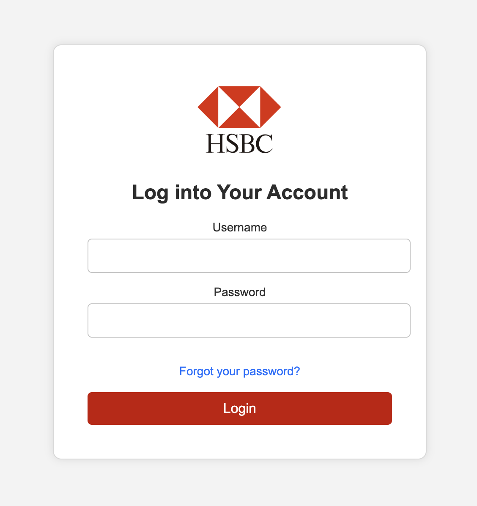
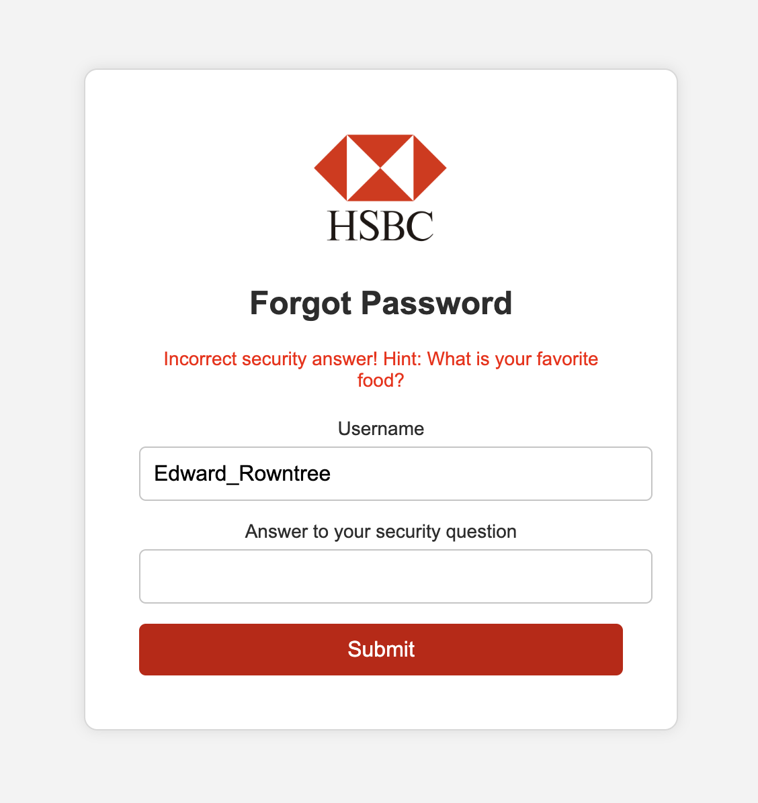
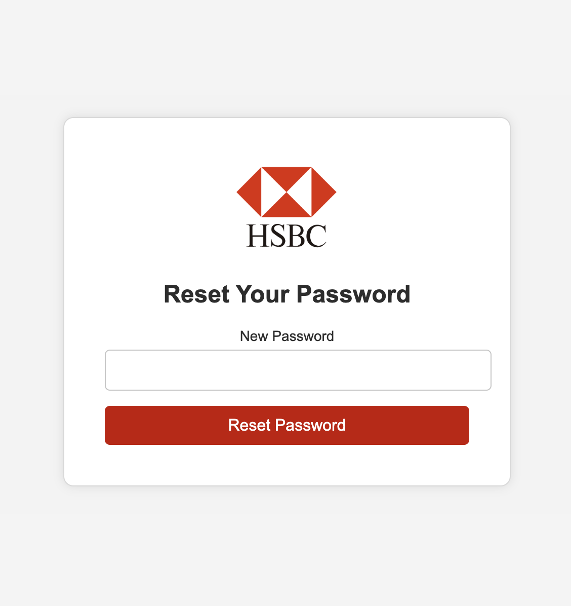

# Cyber Security Demo: Vulnerable Bank Website

This is a **vulnerable web application** designed for educational purposes, specifically for demonstrating common web security issues in a fun and engaging way for school-aged children. It complements the educational video [insert link to your video here] which shows how seemingly harmless online conversations can lead to the disclosure of sensitive information. This website allows for practical demonstrations of how attackers can exploit such information.

## Purpose

This project, paired with the educational video below, aims to:

[](https://www.youtube.com/watch?v=n4DCneIWMLM)

- Teach basic web security principles to children.
- Demonstrate how attackers can exploit information gained through social engineering.
- Simulate brute-force attacks using tools like **OWASP ZAP**, showcasing the techniques used by real attackers.
- Provide a hands-on environment for demonstrating security best practices and the importance of protecting personal information online.

**Disclaimer:** This website contains intentional security flaws. It should never be deployed in a production environment or exposed to the internet.

## How this Website Links to the Video

The video demonstrates a scenario where a user named Ed unknowingly reveals sensitive information to Josh, another online gamer. This website allows you to recreate elements of that scenario:

- **Weak Passwords:** Ed revealed information (pet's name, family connections, location, favourite food) which can be used to guess his password and security questions on this vulnerable site.
- **Brute-force Attacks:** Using OWASP ZAP, you can simulate how attackers can automate password guessing, especially if they have some clues from social engineering.
- **Insecure "Forgot Password" Flow:** The website's weak security question handling mirrors how attackers exploit such features in real-world scenarios.

## Features

- **Login and Logout functionality** with insecure password storage (plain text).
  
- **Forgot Password** flow with weak security question handling.
  
- **Change Password** functionality that demonstrates what an attacker could do.
  
- Vulnerable **session management** and **authentication mechanisms**.

## Requirements

- Docker
- Docker Compose

### Optional

- OWASP ZAP (if testing brute-force or security scans)

## Setup Instructions

### 1. Clone the Repository

```bash
git clone https://github.com/your-repo/vulnerable-bank-website.git
cd vulnerable-bank-website
```

### 2. Build and Start the Project

#### Using Docker and Docker Compose:

**Build and run the application**:

```bash
docker-compose up --build
```

This will set up the following services:

- **Web**: The vulnerable PHP application.
- **DB**: SQLite database to store user information.

### 3. Access the Application

Once the containers are running, you can access the website by navigating to:

```
http://localhost:8080
```

### 4. Usage Instructions

#### Default Users

The database starts with a default user account:

- **Username:** `Edward_Rowntree`
- **Password:** `'Scruff123'` 

### 5. Vulnerable Features to Test

- **Login Page (`login.php`)**: The login form accepts a username and password. This page is vulnerable to brute-force attacks due to the lack of rate-limiting and proper password hashing.
- **Forgot Password (`forgot_password.php`)**: This page allows users to reset their password by answering a security question. It is vulnerable to weak security question handling and missing rate limits.
- **Password Change (`reset_password.php`)**: After answering the security question correctly, users can reset their password. Passwords are stored in plain text, representing poor password security.

### 6. Using OWASP ZAP for Testing

#### Configure OWASP ZAP:

- Ensure OWASP ZAP is installed, running, and configured to intercept requests.
- Ideally, you should use a dedicated browser (e.g., Firefox), and change the settings just for the demo.

#### Brute-force attack simulation:

- Attempt to log in using the web interface (any credentials will do).
- Now that you have a model of the request, use ZAP’s fuzzer to perform brute-force attacks on the login form.
  - Use String payloads for usernames and passwords (students can help you coin these), and use the fuzzer to combine them.
- Sort the results by response length to identify successful login attempts.

### 7. How to Reset the Application

If you need to reset the database and start fresh, follow these steps:

1. **Stop the Docker containers**:

```bash
docker-compose down
```

2. **Rebuild the containers and reset the database**:

```bash
docker-compose up --build
```

## Learning Objectives

This project, combined with the video, is intended for:

- Understanding how social engineering can be used to gather information for cyberattacks.
- Learning how common vulnerabilities (e.g., weak passwords, plaintext storage) are exploited.
- Demonstrating brute-force attacks and how attackers can automate password-guessing techniques.
- Emphasising the importance of protecting personal information online.

## Important Notes

- Do **NOT** use this application in a production environment.
- Only use this in isolated, secure environments for educational purposes.
- Ensure this web application is not exposed to the internet or used in environments where it could cause harm.

## License

This project is released under the MIT License - see the [LICENSE](LICENSE) file for details.

